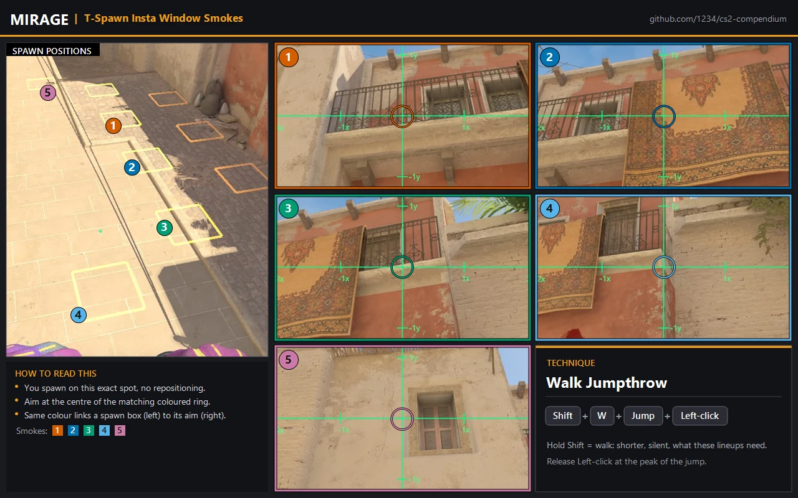
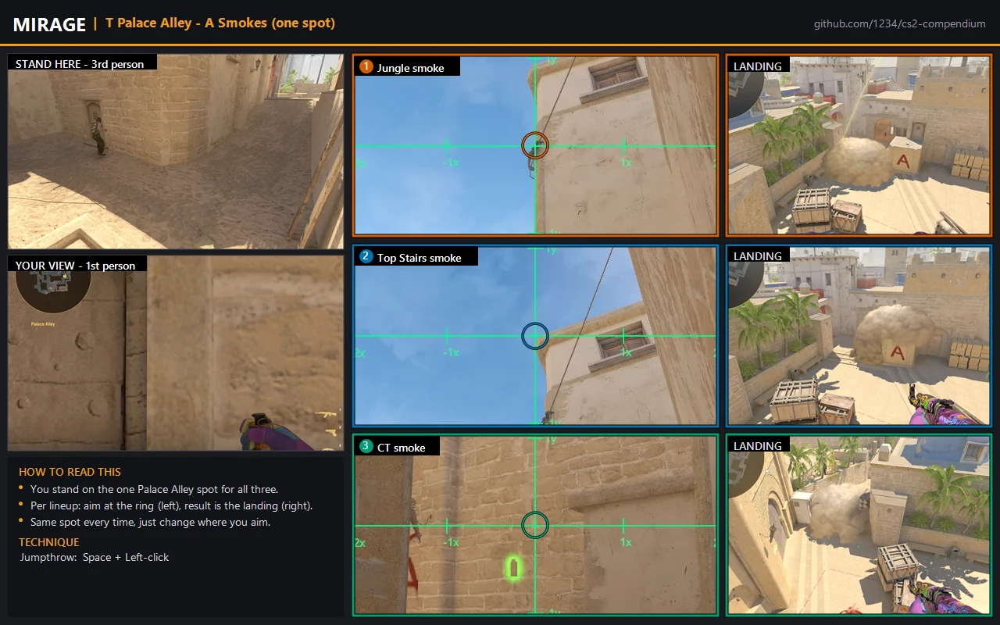

# Mirage utility guides (T-side)

Visual, step-by-step lineup guides for the highest-return Mirage T-side smokes. Each
guide shows the exact stand or spawn position, the aim point, and where the smoke
lands, so you can reproduce it without a video.

For the full Mirage must-know list (flashes and molotovs included), see the
[Utility overview](../README.md#mirage).

---

## Window smokes (from T spawn)

Window is the single highest-value T-side smoke on Mirage. It blocks the mid window
position, the most common early CT and AWP angle, which is what lets you take catwalk
and contest mid safely. The guide shows the insta-window variants from several T-spawn
spots: pick the one that matches where you spawn and learn that one until it is
automatic. Thrown as a **walk jumpthrow** (hold Shift + W, then jump and left-click
together), so the grenade carries less distance and stays silent.

---

## A-execute package from Palace Alley (one spot)

Three smokes from a single Palace Alley spot, Jungle, Top Stairs and CT, thrown
together for the A execute (all **jumpthrows**, Space + left-click). You set up once
and only change where you aim. As a set they cut the main CT angles into A so the team
can cross and take the site, of which getting out of Palace is just one part: Stairs
blocks the elevated stairs angle that overlooks A ramp and Palace (often a CT AWP),
Jungle takes the vision from Jungle and Connector, and CT smokes off the CT rotation
onto the site. A full A take usually adds a Ticket smoke plus a flash or molotov for
the close hiding spots (Under Balcony, Firebox).

---

These guides are part of the CS2 Compendium and are licensed CC BY-SA 4.0. The source
URL is watermarked into each image, so attribution travels with the file.

← [Back to Utility](../README.md) | ← [Back to Training](../../README.md)
